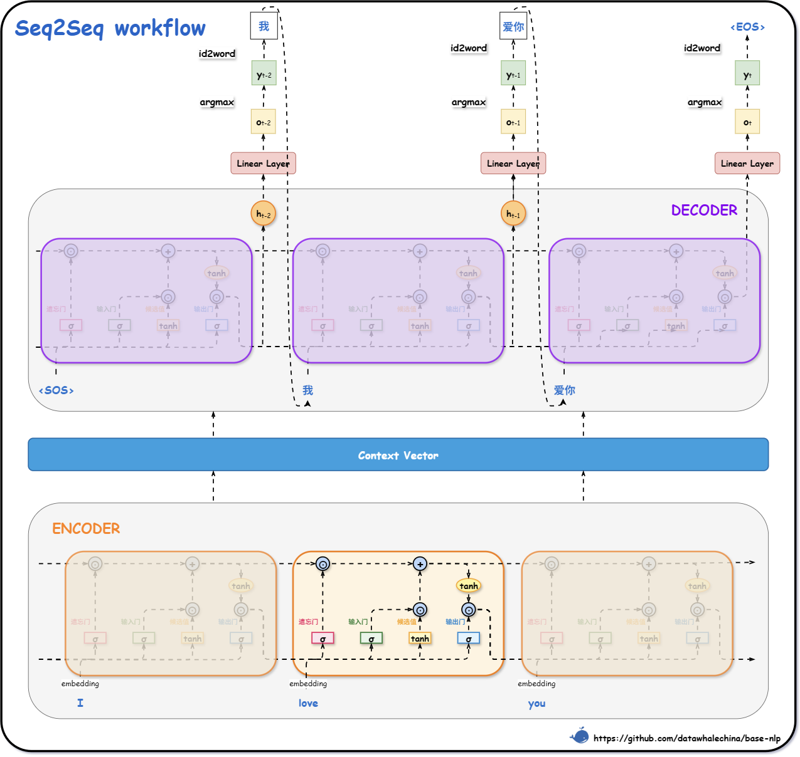
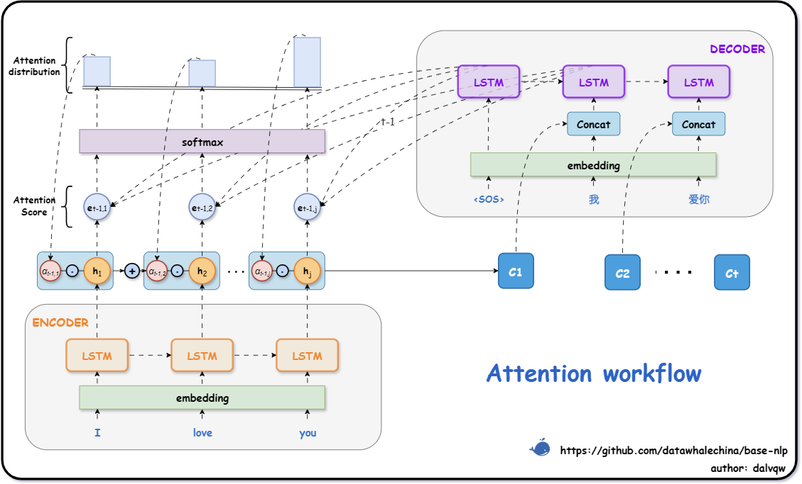
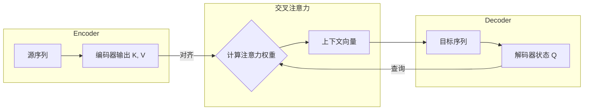
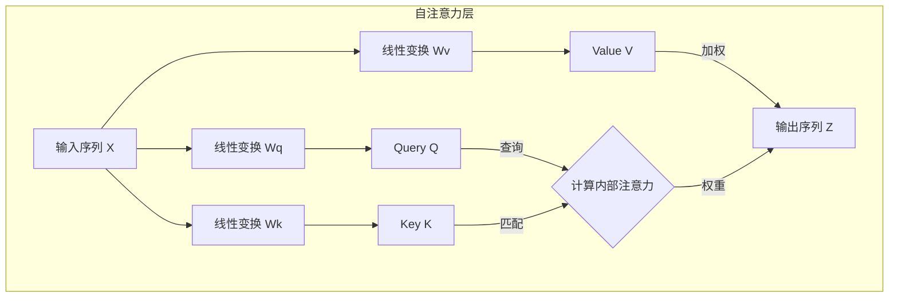

# Tokenizer

## 分词
分词的任务，是把连续的文本序列切分成具有独立语义的基本单元（即“词”或“词元”）。

对于英文等天然有空格作为分隔符的语言，分词相对简单。
但对于中文、日文、泰文等语言，文本是连续的字符流，词之间没有明确的边界。例如，"给阿姨倒一杯卡布奇诺"，计算机需要依据算法将其正确地切分为 ["给", "阿姨", "倒", "一杯", "卡布奇诺"]。

## jieba分词（中文分词库）
它首先基于一个前缀词典（Trie树），高效地构建出一个包含句子中所有可能词语组合的有向无环图（DAG）。接着，通过动态规划算法寻找一条概率最大的路径，作为最终分词结果。
### 分词路径概率计算
该过程可量化为概率计算问题。假设分词路径由词语序列表示为 $w_1, w_2, \dots, w_n$，其中 $w_i$ 代表序列中第 $i$ 个词，则该路径的概率可近似为：

$$
P(w_1, w_2, \dots, w_n) \approx P(w_1) \times P(w_2) \times \dots \times P(w_n)
$$

其中，每个词 $w_i$ 的概率 $P(w_i)$ 可通过其在词典（语料库）中的频率估算，公式为：

$$
P(w_i) = \frac{\text{词 } w_i \text{ 的词频}}{\text{词典中所有词的总词频}}
$$

`jieba` 分词的核心目标，即找到使上述累乘概率值最大的分词路径。

`jieba`能够引入自定义词典，提升特定领域文本的分词效果。用户可以通过添加新词、调整词频等方式，优化分词结果。

>未登录词（OOV, Out-Of-Vocabulary）是一个“相对概念”——相对某个词典/词表未被收录的词。对词典法来说，就是词典里没有；
常见表现是被切成多个字或更小片段，需要通过维护词典（或引入其它模型）来修正。

## RNN向量表示（基于循环神经网络的语言模型）
RNN（循环神经网络）是一类适用于处理序列数据的神经网络架构。它通过在时间步之间共享参数，能够捕捉序列中的上下文信息。

### BiRNN 的结构与原理

BiRNN 的原理很简单：它由两个完全独立的 RNN 构成，并将它们叠加在一起处理信息。

（1）**一个正向 RNN**：按照从左到右的顺序读取输入序列（例如，从 $x_1$到 $x_T$），计算出一系列正向隐藏状态 $(\overrightarrow{h_1}, \overrightarrow{h_2}, ..., \overrightarrow{h_T})$。

（2）**一个反向 RNN**：按照从右到左的顺序读取输入序列（例如，从 $x_T$ 到 $x_1$），计算出一系列反向隐藏状态 $(\overleftarrow{h_1}, \overleftarrow{h_2}, ..., \overleftarrow{h_T})$。

在任意时间步 $t$，BiRNN 的最终输出 $h_t$ 是将该时间步对应的正向 RNN 隐藏状态 $\overrightarrow{h_t}$ 和反向 RNN 隐藏状态 $\overleftarrow{h_t}$ 进行拼接（Concatenate）得到的：

$$
h_t = [\overrightarrow{h_t} ; \overleftarrow{h_t}]
$$

通过这种方式， $h_t$ 就同时包含了输入序列中 $t$ 时刻左右两侧的上下文信息。需要注意，正向和反向的两个 RNN 拥有各自独立的权重参数，它们在训练过程中被 **同时优化**。

> **为什么不直接训练两个独立的 RNN 然后合并结果？**
>
> 当然可以分别训练一个正向 RNN 和一个反向 RNN，最后将它们的输出取平均（线性意见池）或几何平均（对数意见池）。但 BiRNN 的优势在于它是在同一个损失函数下**同时训练**两个方向的权重。所以正向和反向的特征提取是协同进行的，能够更好地适应目标任务，而不需要假设两个方向的预测是相互独立的。而且，BiRNN 彻底消除了对“时间延迟”参数 $M$ 的依赖，模型自动利用所有可用的过去和未来信息。

由于最终的输出是两个独立 RNN 隐藏状态的拼接，如果每个 RNN 的 `hidden_size` 都为 $H$，那么 BiRNN 在每个时间步的输出维度将变为 $2H$。

在 PyTorch 的 `nn.RNN` 模块中，只需将 `bidirectional` 参数设置为 `True` 即可轻松构建一个双向 RNN。其输出 `y` 的最后一个维度（特征维度）将是 `hidden_size` 的两倍，而最终隐藏状态 `h_n` 的第一个维度将是 `num_layers * 2`，分别存储了正向和反向 RNN 在最后一个时间步的隐藏状态。

## 随时间反向传播

前面已经了解了 RNN 如何通过正向传播逐个处理序列信息。接下来，将探讨其训练机制。RNN 的训练实质是标准反向传播（Backpropagation, BP）在时间展开图上的直接应用，称为**随时间反向传播（Backpropagation Through Time, BPTT）** [^3]。具体而言，该方法将 RNN 沿时间维度展开，可视作一个各层参数共享的深层前馈网络，进而在此结构上执行通用的反向传播算法。

假设整个序列的总损失 $L$ 是所有时间步损失 $L_t$ 的总和： $L = \sum_{t=1}^{T} L_t$。我们的目标是计算损失 $L$ 对共享参数 $U$ 和 $W$ 的梯度。

根据加法求导法则，总梯度等于每个时间步损失所贡献的梯度的总和：

$$
\frac{\partial L}{\partial W} = \sum_{t=1}^{T} \frac{\partial L_t}{\partial W}
$$

主要的挑战在于计算单个时间步的梯度 $\frac{\partial L_t}{\partial W}$。由于 $W$ 在每个时间步都参与了计算，当前时刻的隐藏状态 $h_t$ 不仅依赖于当前输入 $x_t$，还通过 $h_{t-1}$ 间接依赖于之前所有时间步的输入和状态。因此，在 $t$ 时刻的损失，其梯度必须沿着时间反向传播，一直追溯到序列的开端。

使用链式法则（向量-导数矩阵形式）， $\frac{\partial L_t}{\partial W}$ 可分解为：

$$
\frac{\partial L_t}{\partial W} = \sum_{k=1}^{t} \underbrace{\frac{\partial L_t}{\partial h_t}}_{\text{梯度}} \cdot \underbrace{\frac{\partial h_t}{\partial h_k}}_{\text{导数矩阵连乘}} \cdot \underbrace{\frac{\partial h_k}{\partial W}}_{\text{直接影响}}
$$

其中， $\frac{\partial h_k}{\partial W}$ 是 $h_k$ 关于参数 $W$ 的导数矩阵； $\frac{\partial h_t}{\partial h_k}$ 表示从第 $k$ 步到第 $t$ 步的“传播的导数矩阵”，其本身是导数矩阵的连乘：

$$
\frac{\partial h_t}{\partial h_k} = \prod_{i=k+1}^{t} \frac{\partial h_i}{\partial h_{i-1}}
$$

这个连乘的形式正是 RNN 产生问题的根源所在。

## RNN 的局限性

尽管 RNN 在理论上可以捕捉长距离依赖，但在实践中，基于 BPTT 的反向传播在时间维度上的导数矩阵连乘，带来了以下问题：

### 梯度消失与梯度爆炸

BPTT 链式求导的关键，在于梯度的反向传播路径上会形成一个连乘项 $\prod_{i=k+1}^{t} \frac{\partial h_i}{\partial h_{i-1}}$。以 $h_i = \tanh(U x_i + W h_{i-1})$ 为例，其传播的导数矩阵近似为：

$$
\frac{\partial h_i}{\partial h_{i-1}} \approx J_{\tanh}(U x_i + W h_{i-1}) \cdot W
$$

其中 $J_{\tanh}$ 表示 $\tanh$ 的导数矩阵。这意味着，从遥远的 $k$ 步到当前 $t$ 步的梯度传递，需要经历 $t-k$ 次与权重矩阵 $W$ 和激活函数导数矩阵的相乘。

1.  **梯度消失（Vanishing Gradients）**：在 RNN 中，权重矩阵 $W$ 的值通常会被初始化为较小的值。如果 $W$ 的范数（可以理解为其对向量的缩放能力）小于1，或者激活函数的导数（如 $\tanh'$ 最大为 1，通常小于 1）导致连乘项变小，那么多次相乘之后，梯度值会以指数级速度衰减，迅速趋近于0。当序列很长时（即 $t-k$ 很大），来自遥远过去的梯度信号在传播到当前步时，几乎完全消失。

2.  **梯度爆炸（Exploding Gradients）**：反之，如果 $W$ 的范数大于1，梯度值则会指数级增长，最终变成一个非常大的数值（Inf 或 NaN），导致模型训练崩溃。梯度爆炸问题相对容易发现和处理，一种常见的解决方法是**梯度裁剪（Gradient Clipping）**，即当梯度的范数超过某个阈值时，就将其缩放到该阈值。

### 长距离依赖

梯度消失在实践中比梯度爆炸更棘手，它直接导致了**长距离依赖问题（Long-term Dependency Problem）** [^4]。

-   **反向传播视角**：梯度消失意味着，模型无法学习到序列中相距遥远的词之间的依赖关系。正如 Werbos 所指出的，BPTT 本身是计算梯度的精确方法，但深层网络（或长序列）中的连乘效应是数学上的必然。例如，在句子 “孙悟空初到天庭时，被玉帝封为‘**弼马温**’，他嫌官小，心中不忿，便打出天门，返回花果山，自封‘齐天大圣’，后来又大闹天宫，搅乱了蟠桃盛会，偷吃了老君的金丹，最终被如来佛祖镇压在五行山下。五百年后，当有神仙旧事重提，用这个官职来称呼他时，依然是在**嘲讽**他。” 中，要正确理解结尾处“**嘲讽**”的含义，模型必须能关联到句子最开头的“**弼马温**”是一个低微官职这一事实。但由于两者之间间隔了极长的叙述，误差梯度在从“嘲讽”反向传播到“弼马温”时，可能已经衰减为零，导致模型无法捕捉到这种关键的远距离语义依赖。

-   **正向传播视角**：也可以理解为**信息遗忘**或**近期偏置**。在正向计算过程中，每一步的信息都会被新的输入和循环权重 $W$ “稀释”或“覆盖”。经过足够多的时间步后，序列最初的信息在隐藏状态中可能已所剩无几。这就好像两个句子，即使开头的词不同，在经过很长的相同后续序列后，它们最终的隐藏状态也可能变得几乎没有差别，模型“遗忘”了最初的差异。

### 单向性

常规 RNN 的信息流是单向的， $t$ 时刻的计算只能利用 $t$ 时刻之前的信息，无法利用未来的上下文信息。但在很多 NLP 任务中（如完形填空、机器翻译），一个词的含义同时取决于它的前文和后文。

> **双向循环神经网络** 能够通过结合正向和反向的信息流来解决单向性的问题。此外，为了学习更复杂的特征表示，还可以将多个 RNN 层堆叠起来，构成**深度循环神经网络**。然而，这些变体都未能从根本上解决梯度传播带来的长距离依赖问题。为了攻克这一核心难题，研究者们设计了两种更为精巧的门控 RNN 结构——**长短期记忆网络**和**门控循环单元**，下一节将对此进行详细探讨。

## seq2seq 架构

Seq2Seq 的核心思想借鉴了人类进行翻译的过程——先完整地阅读并理解源语言的整个句子，形成一个综合的**语义表示**；然后，基于这个语义表示，开始用目标语言逐词生成译文。它的目标是从 `Input` 到 `Output` 的**转换**，而非重构。模型同样被拆分为两个组件：

（1）**编码器**：扮演“阅读和理解”的角色。它负责接收整个输入序列，并将其信息压缩成一个固定长度的**上下文向量（Context Vector）** ，通常记为 $C$。这个向量就是输入序列的“语义概要”。

（2）**解码器**：扮演“组织语言并生成”的角色。它接收上下文向量 $C$ 作为初始信息，然后逐个生成输出序列中的词元。

在最初基于 Seq2Seq 架构的模型中，编码器和解码器通常都由 RNN 或其变体（如 LSTM、GRU）构成。以“I love you” -> “我爱你”的翻译任务为例，展示了一个基于 LSTM 的 Seq2Seq 架构如何将编码、解码与自回归机制结合在一起的完整工作流程。

[//]: # ()

  
  
图 4-1 Seq2Seq 详细工作流程

### 1.3 编码器 (Encoder)

编码器的任务是生成上下文向量 $C$。它可以是一个标准的 RNN（或 LSTM），逐个读取输入序列的词元 $x_1, x_2, \dots, x_T$。在每个时间步，它都会根据前一时刻的状态和当前输入来更新自身状态。对于标准 RNN，这个过程可以简化为 $h_t = f(h_{t-1}, x_t)$；而对于 LSTM，则同时更新隐藏状态和细胞状态，$(h_t, c_t) = \text{LSTM}((h_{t-1}, c_{t-1}), x_t)$。当处理完最后一个输入词元 $x_T$ 后，编码器最终的状态就被用作整个输入序列的上下文向量 $C$。对于 LSTM，上下文向量 $C$ 通常就是最后一个时间步的隐藏状态和细胞状态的元组，即 $C = (h_T, c_T)$。虽然这是最常见的做法，但上下文向量 $C$ 也可以由所有时间步的隐藏状态 $\{h_1, h_2, \dots, h_T\}$ 经过某种变换（如拼接后通过一个线性层、或取平均池化）得到，以期保留更全面的序列信息。在图中，编码器依次处理英文单词 “I”、“love”、“you” 的词嵌入向量，并将最终的状态打包成上下文向量（Context Vector）传递给解码器。

> 由于编码器在处理时可以访问整个输入序列，因此它可以使用**双向 RNN**。通过同时从正向和反向两个方向读取序列，编码器可以为每个词元生成更全面的上下文表示，从而得到一个信息更丰富的上下文向量 $C$。

### 1.4 解码器 (Decoder)

解码器的任务是根据上下文向量 $C$ 生成输出序列 $y_1, y_2, \dots, y_{T'}$。它同样可以使用一个标准的 RNN（或 LSTM）作为核心，但它扮演的角色是**生成器**而非信息压缩器，因此其工作流程与编码器有显著差异。

- **初始化** ：解码器的初始状态直接由编码器生成的上下文向量 $C$ 初始化。对于 LSTM，这意味着初始的隐藏状态和细胞状态 $(h^{\prime}_0, c^{\prime}_0)$ 都被设置为编码器的最终状态 $C=(h_T, c_T)$。这相当于将整个输入序列的“语义概要”交给了解码器。

- **自回归生成 (Auto-regressive Generation)** ：解码器逐个生成词元。
    
    - 在第一个时间步，它以初始状态（对 LSTM 而言是 $(h^{\prime}_0, c^{\prime}_0)$ ）和一个特殊的起始符 `<SOS>` (Start of Sentence) 作为输入，生成第一个目标词元 $y_1$。

    - 在第二个时间步，它将上一步的状态（ $(h^{\prime}_1, c^{\prime}_1)$ ）和 **上一步生成的词元 $y_1$** 作为输入，生成第二个目标词元 $y_2$。

    - 这个过程不断重复，状态也随之更新。对于 LSTM，这个更新过程可以表示为 $(h^{\prime}_t, c^{\prime}_t) = \text{LSTM}((h^{\prime}_{t-1}, c^{\prime}_{t-1}), y_{t-1})$。这个过程将持续进行，直到生成一个特殊的终止符 `<EOS>` (End of Sentence) 或达到预设的最大长度。图中展示的正是这个过程，解码器首先接收 `<SOS>` 符和上下文向量，生成第一个汉字“我”；接着，它将“我”作为下一步的输入，生成“爱你”；这个过程将持续进行，直到生成句子结束符 `<EOS>` 为止。

> 解码器在生成序列时，是按照从左到右的顺序逐词生成的，它在预测当前词元时不能“看到”未来的词元。为满足因果性约束，解码器通常使用单向 RNN（或采用因果掩码的解码结构）。

在每个生成步骤中，解码器的隐藏状态 $h^{\prime}_t$ 会经过一个额外的全连接层（通常带有 Softmax 激活函数），以计算出词汇表中每个单词的概率分布。然后，模型会选择概率最高的单词作为当前时间步的输出。

### 应用与泛化

Seq2Seq 架构的成功也揭示了其背后 Encoder-Decoder 框架的强大通用性。这个框架本质上定义了一个“将一种数据形态转换为另一种数据形态”的通用范式，因此其应用远不止于文本到文本的任务。

- **语音识别（Audio-to-Text）**：编码器可以是一个处理音频信号的模型（如基于RNN或卷积的模型），提取语音特征并生成上下文向量；解码器则基于此向量生成识别出的文本序列。
- **图像描述生成（Image-to-Text）**：编码器也可以是一个卷积神经网络（CNN），负责“阅读”整张图片并提取其视觉特征，生成一个概括图片内容的上下文向量；解码器则根据该向量生成一段描述性的文字，实现“看图说话”。
- **文本到语音（Text-to-Speech, TTS）**：与语音识别相反，编码器处理输入文本，解码器则生成对应的音频波形数据。
- **问答系统（QA）**：模型可以将一篇参考文章和用户提问一起编码，然后解码生成问题的答案。
- **任务范式统一**：甚至传统的分类任务也可以被“生成化”。例如，在文本分类任务中，可以构造一个特殊的输入（即 Prompt），引导模型直接生成类别名称。这种方式极大地统一了不同 NLP 任务的处理范式。一个具体的例子如下：
    - **输入**: `"请判断以下文本的类别。可选类别列表为：[科技, 体育, 财经]。文本：中国队在世界游泳锦标赛上获得了五枚金牌。"`
    - **期望输出**: `"体育"`

通过替换不同的编码器和解码器实现，Seq2Seq 架构可以灵活地应用于各种跨模态的转换任务中。

### Seq2Seq 的局限性：信息瓶颈

尽管基于 Seq2Seq 架构的模型取得了巨大成功，但它也存在一个明显的缺陷——**信息瓶颈（Information Bottleneck）**。

这个问题在概念上与前一章讨论**长距离依赖**非常相似，但发生在不同的层面：
- **长距离依赖**是 RNN **内部**的问题，指信息在**单一序列处理过程**中因梯度累乘而难以从序列开端传递到末端。LSTM 通过门控机制和细胞状态缓解了这个问题。
- **信息瓶颈**则是 Encoder-Decoder **架构层面**的问题。它与 RNN 内部如何传递信息无关，而在于它规定了编码器和解码器之间唯一的沟通桥梁就是一个**固定长度**的上下文向量 $C$。

编码器必须将输入序列的所有信息，无论其长短，都压缩到这个向量中。可以说，编码器自身的长距离依赖问题，进一步加剧了信息瓶颈的严重性。即便编码器使用了 LSTM，能更好地在内部传递信息，但当输入句子很长时，这个最终的上下文向量 $C$ 依然很难承载全部的语义细节，模型可能会“遗忘”掉句子开头的关键信息，导致生成质量下降。这就好比让一个人将一篇长文的所有细节都总结成**一句话**，然后仅凭这一句话去复述原文，必然会丢失大量信息。

可以用一个更具体的例子来理解这个问题。假设在做一个对联生成的任务，上联是“两个黄鹂鸣翠柳”。在生成下联时，期望第一个词（如“一行”）能够主要参考上联的第一个词“两个”，第二个词（如“白鹭”）主要参考“黄鹂”，以此类推，形成对仗。

不过，在标准的 Seq2Seq 架构中，存在两个核心问题：

（1）**信息稀释**：“两个”这个词的信息经过多步 RNN 传递后，在最终的上下文向量 $C$ 中可能已经变得非常微弱。

（2）**信息无差别（缺乏倾向性）**：解码器在生成每一个词（“一行”、“白鹭”、“上青天”）时，所依赖的全局信息都是同一个、包含了整个上联概要的上下文向量 $C$。它没有一种机制去“特别关注”或“倾向于”当前生成位置所对应的输入部分。

> 即使采用：将 $C$ 作为解码器**每个时间步的额外输入**，问题依然存在。因为每个时间步输入的都是**同一个** $C$，模型仍然无法学会有选择性地、有侧重地利用输入信息，缺乏这种动态的“倾向性”。

为了解决这个信息瓶颈和对齐问题，后续研究者们引入了**注意力机制**。允许解码器在生成每个词元时，都能“回头看”并动态地计算一个权重分布，从而重点关注输入序列的不同部分，而不是仅仅依赖于单一的上下文向量。这极大地提升了长序列任务的性能，并直接催生了后来更强大的 Transformer 模型。

---

## 注意力机制

标准 Seq2Seq 架构存在的一个核心缺陷：**信息瓶颈**。编码器需要将源序列的所有信息，不论长短，全部压缩成一个固定长度的上下文向量 $C$。这种机制在处理长序列时，很容易丢失序列开头的关键信息，同时也无法让解码器在生成不同词元时，有选择性地关注输入的不同部分。

用提到的对联任务举例，当上联是“两个黄鹂鸣翠柳”时，期望模型在生成下联时：
-   生成第一个词“一行”时，主要关注上联的“两个”。
-   生成第二个词“白鹭”时，主要关注上联的“黄鹂”。
-   ...

但是标准的 Seq2Seq 架构的模型在生成“一行”、“白鹭”、“上青天”的每一个词时，所依赖的都是**同一个、包含了整个上联概要**的上下文向量 $C$。模型缺乏一种动态的、有倾向性的“关注”能力。为了解决这个问题，**注意力机制 (Attention Mechanism)** 被提出。

### 注意力机制的设计原理

注意力机制的原理，可以通俗地理解为从“一言以蔽之”到“择其要者而观之”的转变。人类在进行阅读理解或翻译时，并不会将整个句子或段落的信息平均地记在脑海里。当回答特定问题或翻译特定词组时，我们的注意力会自然地聚焦到原文中的相关部分。

注意力机制就是对这种认知行为的模拟。它的原理是**在解码器生成每一个词元时，不再依赖一个固定的上下文向量，而是允许它“回头看”一遍完整的输入序列，并根据当前解码的需求，自主地为输入序列的每个部分分配不同的注意力权重，然后基于这些权重将输入信息加权求和，生成一个动态的、专属当前时间步的上下文向量**。通过这种方式，模型便获得了“择其要者而观之”的能力：
-   在生成“一行”时，模型可以学会将最大的权重分配给“两个”所对应的编码器状态。
-   在生成“白鹭”时，则将最大的权重分配给“黄鹂”所对应的状态。

这个动态计算的权重，就是**注意力权重**；而整个动态计算上下文向量的过程，就是**注意力机制**。

### 问题的根源与固定对齐策略的局限

为了更直观地理解注意力机制的必要性，可以跟随一个逐步深入的思路。标准的 Seq2Seq 模型之所以表现不佳，根源是它试图将源序列的所有信息**无差别**地压缩进一个向量。但在对联这类任务中，输入和输出之间存在着明显的**局部对应关系**。一个直观的想法是能不能建立一种固定的对齐策略？例如，在生成下联第一个词时，就只使用上联第一个词的编码信息；生成第二个词时，就只用第二个词的信息，以此类推。

这个想法可以表示为：
-   $C_1 = h_1$   (生成第一个词的上下文是第一个编码状态)
-   $C_2 = h_2$   (生成第二个词的上下文是第二个编码状态)
-   ...

这种方法在处理像对联这样长度相等、词序对应的“特例”时似乎是可行的。但它的局限性非常明显：

（1）**要求序列等长**：对于不等长的序列（如中英文翻译），这种一对一的映射关系立刻失效。

（2）**对齐关系僵化**：它假设了输入和输出的对齐关系是固定不变的，但实际任务中的对应关系可能非常复杂（如一对多、多对一）。

这种固定对齐策略过于理想化，缺乏通用性。我们需要一种更灵活、更具普适性的方法。

### 注意力机制的动态加权原理

既然只取一个输入信息过于绝对，那么退一步，是否可以把所有输入信息都利用起来，但给它们分配不同的“重要性”呢？这就是通过动态加权进行对齐的思想，即**加权求和**。我们可以为解码的第 $t$ 步，动态地计算一个上下文向量 $C_t$，它由编码器**所有**的隐藏状态 $(h_1, h_2, \dots, h_{T_x})$ 加权求和得到：

$$
C_t = \sum_{j=1}^{T_x} \alpha_{tj} h_j
$$

其中， $\alpha_{tj}$ 就是在解码第 $t$ 个词时，分配给输入第 $j$ 个词的**注意力权重**。

在这个思路下，前面提到的“固定对齐策略”可以看作是它的一个特例。例如，当 $\alpha_{11}=1$ 且其他所有 $\alpha_{1j}=0$ 时，就实现了 $C_1 = h_1$ 的效果。

### 如何确定权重？

加权求和的思路虽然灵活，但它引入了一个新的问题：**权重 $\alpha_{tj}$ 从何而来？**

这个权重显然不能是固定的。它必须是**动态的**，应该根据当前的解码需求来决定。例如，当解码器正要生成与“黄鹂”对应的词时，权重 $\alpha_{t, \text{黄鹂}}$ 就应该最大。所以我们需要一个额外的模块或机制，它能够：

（1）审视当前解码器的状态（例如，解码器上一时刻的隐藏状态 $h^{\prime}_{t-1}$）。

（2）将这个状态与编码器的每一个隐藏状态 $h_j$ 进行比较。

（3）根据比较结果，生成一组相应的权重 $(\alpha_{t1}, \alpha_{t2}, \dots, \alpha_{t,T_x})$。

让模型**自行学习**如何根据当前上下文来计算这组权重，正是注意力机制的关键。

### 注意力机制详解

带有注意力机制的 Encoder-Decoder 模型，其整体结构与标准 Seq2Seq 类似，主要区别在于解码器部分。编码器的工作保持不变，但是需要向解码器提供**所有时间步**的隐藏状态序列 $(h_1, h_2, \dots, h_{T_x})$，而不仅仅是最后一个时间步的状态。解码器在生成第 $t$ 个目标词元 $y_t$ 时，会通过三步进行“注意力计算”，来动态生成该时刻的上下文向量 $C_t$。这个过程通常以上一时刻的解码器隐藏状态 $h^{\prime}_{t-1}$ 为起点。

### 注意力计算三部曲

（1）计算相似度

使用解码器上一时刻的隐藏状态 $h^{\prime}_{t-1}$ 与编码器的每一个隐藏状态 $h_j$ 计算一个分数，这个分数衡量了在当前解码时刻，应当对第 $j$ 个输入词元投入多少“关注”。

$$
e_{tj} = \text{score}(h^{\prime}_{t-1}, h_j)
$$

这个分数越高，代表关联性越强。计算这个分数的方式有很多种，例如简单的点积、或者引入一个可学习的神经网络层。

（2）计算注意力权重

得到输入序列所有位置的注意力分数 $(e_{t1}, e_{t2}, \dots, e_{t,T_x})$ 后，为了将它们转换成一种“权重”的表示，可使用 **Softmax** 函数对其进行归一化。这样，就能得到一组总和为 1、且均为正数的注意力权重 $(\alpha_{t1}, \alpha_{t2}, \dots, \alpha_{t,T_x})$。

$$
\alpha_{tj} = \text{softmax}(e_{tj}) = \frac{\exp(e_{tj})}{\sum_{i=1}^{T_x} \exp(e_{ti})}
$$

这组权重 $\alpha_t$ 构成了一个概率分布，清晰地表明了在当前解码步骤 $t$，注意力应该如何分配在输入序列的各个位置上。

（3）加权求和，生成上下文向量

最后，使用上一步得到的注意力权重 $\alpha_{tj}$，对编码器的所有隐藏状态 $h_j$ 进行加权求和，从而得到当前解码时刻 $t$ 专属的上下文向量 $C_t$。

$$
C_t = \sum_{j=1}^{T_x} \alpha_{tj} h_j
$$

这个 $C_t$ 向量，由于是根据当前解码需求动态生成的，它比原始 Seq2Seq 的那个固定向量 $C$ 包含了更具针对性的信息。

### 结合上下文进行预测

得到动态上下文向量 $C_t$ 后，模型会将其与当前解码器自身的输入词元 $y_{t-1}$ 的词嵌入结合起来（最常见的方式是将两者**拼接**），形成一个新的、信息更丰富的向量。

最后，将这个拼接后的向量连同上一时刻的状态 $h^\prime_{t-1}$ 一起送入解码器的 RNN 单元，计算出当前时刻的状态 $h^\prime_{t}$，并基于 $h^\prime_{t}$ 预测出最有可能的输出词元 $y_t$。整个过程可以通过图 4-2 来概括：

  
  
图 4-2 Attention 工作流程

### 一种高效的注意力打分函数

计算相关性分数的函数有多种设计，其中一种非常高效的方法，是直接计算查询向量（ $h^\prime_{t-1}$ ）和键向量（ $h_j$ ）的**点积**，并对其进行**缩放**。这种思想也是后续通用注意力框架的核心。其计算方式非常简洁：

$$
\text{score}(h^\prime_{t-1}, h_j) = \frac{{h^\prime_{t-1}}^T \cdot h_j}{\sqrt{d_k}}
$$

其中：
-   ${h^\prime_{t-1}}^T \cdot h_j$ 就是两个向量的点积。点积是衡量向量相似度的一种有效方式。
-   $d_k$ 是键向量（在这里是编码器隐藏状态）的维度。
-   除以 $\sqrt{d_k}$ 是一个关键的缩放步骤。当向量维度 $d_k$ 很大时，点积的结果的方差也会很大，这可能导致一些维度的值非常大，从而将 Softmax 函数推向其梯度极小的区域（即概率值极端地趋近于 0 或 1），造成梯度消失，使模型难以训练。通过除以 $\sqrt{d_k}$ 进行缩放，可以有效缓解这个问题，使训练过程更加稳定。

### 注意力机制的价值

引入注意力机制，不仅仅是对 Seq2Seq 架构的一个小修补，它还带来了一个全新的视角。

（1）**克服信息瓶颈，提升性能**

最直接的好处是，注意力机制彻底打破了信息必须被压缩成一个固定长度向量的限制。解码器在每一步都可以直接访问到源序列的全部信息，并根据需要动态聚焦。这使得模型在处理尤其是长序列时，性能得到了巨大的提升。

（2）**提供可解释性，实现“词对齐”**

注意力机制的另一个巨大价值在于它提供了很好的**可解释性**。注意力权重矩阵 $\alpha$ 本身就蕴含了丰富的信息。可以将这个矩阵可视化，来观察当模型生成某个输出词时，它的“注意力”主要集中在输入的哪些词上。

### 注意力机制的查询-键-值 (QKV) 范式

为了将刚刚描述的注意力计算过程抽象出来，形成一个更通用的思想，可以引入一个概念框架，即 **查询-键-值 （Query-Key-Value, QKV）** 。这个范式将注意力的计算过程类比为一次信息检索：

- **查询（Query）**：代表了当前的需求或意图。在 Seq2Seq 中，这就是解码器在生成下一个词元前的状态 $h^\prime_{t-1}$，可以理解为它在“查询”的是“根据我现在的情况，我最需要输入序列的哪部分信息？”
- **键（Key）**：可以看作是输入序列中各个信息片段的“标签”或“索引”，用于和查询进行匹配。在 Seq2Seq 中，输入序列的每个词元的隐藏状态 $h_j$ 都对应一个“键”。
- **值（Value）**：是与“键”对应的实际信息内容。在基础的注意力机制中，“键”和“值”通常是相同的，都来自于编码器的隐藏状态 $h_j$。

> 无论形式如何变化，注意力机制的本质都可以概括为：通过**查询（Q）**和一系列**键（K）**计算相关性（权重），然后利用这个权重，对与各个键对应的**值（V）** 进行加权求和，得到最终的输出。

具体计算过程，可以用一个凝练的数学公式来统一表达，这就是 **缩放点积注意力（Scaled Dot-Product Attention）** ，它也是 Transformer 模型的核心组件之一 [^2]：

$$
\text{Attention}(Q, K, V) = \text{softmax}\left(\frac{QK^T}{\sqrt{d_k}}\right)V
$$

这个公式准确概括了注意力的计算步骤：

（1）**$QK^T$**：计算查询矩阵 $Q$ 和键矩阵 $K$ 的转置的点积，得到原始的**注意力分数**。

（2）**$\sqrt{d_k}$**：对分数进行缩放，以维持训练稳定性，其中 $d_k$ 是键向量的维度。

（3）**softmax(...)**：通过 Softmax 函数将分数归一化，得到**注意力权重**。

（4）**...V**：将得到的权重矩阵与值矩阵 $V$ 相乘，进行**加权求和**，得到最终的输出。

这个通用的范式很实用，是理解后续 Transformer 等更先进模型的基础。在不同的任务中，只需要思考如何定义场景中的 Q、K、V 即可应用注意力机制。
- 在刚刚讨论的 Seq2Seq 中：Q 是解码器状态，K 和 V 都是编码器状态序列。
- 在后续的自注意力 (Self-Attention) 机制中，Q, K, V 将全部来源于同一个序列自身。

此外，为了增加模型的表达能力，还可以在计算注意力之前，对原始的 Q, K, V 向量各自通过一个独立的全连接层进行**线性变换**，得到新的 Q', K', V'，再用它们进行注意力的计算。这种做法可以让模型学习到在不同的“子空间”中进行信息匹配和聚合。

## 深入解析 Transformer

注意力机制通过动态加权的方式，克服了传统 Seq2Seq 模型中的“信息瓶颈”问题。但是，这些模型依然依赖于 RNN 来处理序列信息，也就是说它们必须按顺序，一个词元接一个词元地进行计算，这在处理长序列时效率低下，并且存在长距离依赖信息丢失的问题。

2017年，Google 的研究团队发表了一篇名为《Attention Is All You Need》的论文，提出了一种全新的架构——**Transformer** [^1]。这篇论文的标题很有冲击力，其思想也同样有颠覆性。它抛弃了传统的 RNN 和卷积网络，整个模型基于注意力机制来构建。Transformer 的提出在自然语言处理领域具有划时代的意义。它不仅凭借其出色的并行计算能力极大地提升了训练效率，还更有效地捕捉了文本中的长距离依赖关系，为后续的 BERT、GPT 等大规模预训练模型的诞生提供了架构基础。

### 自注意力机制

从根本上说，要让模型理解一段文本，就需要提取其“序列特征”，即将文本中所有词元的信息以某种方式整合起来。RNN 通过依次传递隐藏状态来顺序地整合信息，而 Transformer 则选择了一条截然不同的道路。其核心是 **自注意力机制**。它不再依赖于顺序计算，而是将提取序列特征的过程看作是输入序列“自己对自己进行注意力计算”。序列中的每个词元都会“审视”序列中的所有其他词元，来动态地计算出最能代表当前词元上下文含义的新表示。与上一节介绍的交叉注意力不同，在自注意力中，**Query、Key、Value 均来源于同一个输入序列**。

举个例子，在句子“苹果公司发布了新款手机，**它**采用了最新的芯片”中，要理解代词“它”指的是“新款手机”而不是“苹果公司”，模型就需要将“它”与句子中的其他词元进行关联。自注意力机制正是通过计算“它”对句中其他所有词的注意力权重来实现这一点的。

#### 自注意力与交叉注意力的区别

从结构上看，自注意力与交叉注意力的区别在于**信息的来源和流动方向**。在交叉注意力机制中，信息在两个不同的序列之间流动。通常，**Query** 来自解码器（代表当前的目标序列状态），而 **Key** 和 **Value** 来自编码器的所有输出（代表完整的源序列信息）。其目的是在生成目标序列的每一步时，从源序列中寻找最相关的信息。

而在**自注意力**机制中，信息则是在**同一个序列内部**进行流动和重组。它的 **Query, Key, 和 Value 都来自同一个输入序列**。其目的是为了捕捉输入序列内部的依赖关系，重新计算序列中每个词元的表示，使其包含更丰富的上下文信息。

总结来说，尽管底层的加权求和计算方式相似，但两者在架构上的目标完全不同：

- **交叉注意力**：用于**对齐**和**整合**两个**不同**序列之间的信息。
- **自注意力**：用于**理解**和**重构**单个序列**内部**的依赖关系。

#### 自注意力的计算过程

自注意力的计算过程与上一节介绍的 QKV 范式完全一致，关键区别在于 Q, K, V 的来源。

（1）**生成 Q, K, V 向量**：

对于输入序列中的**每一个**词元，首先获取其词嵌入向量 $x_i$。然后，将该向量分别与三个可学习的、在整个模型中共享的权重矩阵 $W^Q, W^K, W^V$ 相乘，生成该词元专属的 Query 向量 $q_i$、Key 向量 $k_i$ 和 Value 向量 $v_i$。

$$
q_i = x_i W^Q \\
k_i = x_i W^K \\
v_i = x_i W^V
$$

这三个矩阵的作用是将原始的词嵌入向量投影到不同的、专门用于注意力计算的表示空间中，赋予了模型更大的灵活性。

（2）**计算注意力分数**：

为了计算第 $i$ 个词元的新表示，需要用它的 Query 向量 $q_i$ 去和**所有**词元（包括它自己）的 Key 向量 $k_j$ 计算点积，得到注意力分数。

$$
\text{score}(i, j) = q_i \cdot k_j
$$

（3）**缩放与归一化**：

将得到的分数除以一个缩放因子 $\sqrt{d_k}$（$d_k$ 是 Key 向量的维度），然后通过 Softmax 函数进行归一化，得到最终的注意力权重 $\alpha_{ij}$。这个缩放步骤的目的与上一节中介绍的一致，都是为了在训练过程中保持梯度稳定。当向量维度 $d_k$ 较大时，点积结果的方差会增大，可能将 Softmax 函数推向其梯度极小的区域，从而导致梯度消失，影响模型学习。进行缩放可以有效缓解这个问题。

$$
\alpha_{ij} = \text{softmax}\left(\frac{q_i \cdot k_j}{\sqrt{d_k}}\right)
$$

4.  **加权求和**：

使用计算出的权重 $\alpha_{ij}$ 对**所有**词元的 Value 向量 $v_j$ 进行加权求和，得到第 $i$ 个词元经过自注意力计算后得到的新表示 $z_i$。

$$
z_i = \sum_j \alpha_{ij} v_j
$$

通过这个过程，输出向量 $z_i$ 不再仅仅包含原始词元 $x_i$ 的信息，而是融合了整个序列中所有与之相关词元的信息，成为一个上下文感知的、更丰富的表示。其本质可以理解为：序列中的每个词元都同时扮演着“查询（Q）”、“键（K）”和“值（V）”三种角色。通过计算查询与其他所有词元的键之间的相关性，来决定如何加权融合所有词元的值，从而为每个词元生成一个全新的、深度融合了全局上下文信息的表示。

> 既然 Q, K, V 都来自同一个输入 X，为什么不直接用 X 计算，而要引入三个独立的权重矩阵 $W^Q, W^K, W^V$？甚至，为什么是三个，而不是两个或四个？
>
> 这可以类比在图书馆查资料的过程：
> - **Query (Q) - 要问的问题**：代表了我们主动想查询的意图。
> - **Key (K) - 书的索引/标签**：代表了书本内容的关键特征，用于被动地和你的问题进行匹配。
> - **Value (V) - 书的具体内容**：代表了书本实际包含的信息。
>
> 我们的“问题”和书本的“索引”可能都源于同一个知识领域（同一个输入 X），但它们在信息检索这个任务中扮演的角色是截然不同的。$W^Q, W^K, W^V$ 这三个矩阵的作用，就是让模型学会将原始输入 X 投影到三个功能不同的空间中，分别去扮演好“查询者”、“被查询的索引”和“信息提供者”这三种角色。Q-K 配对解决了“如何定位相关信息”的问题，而 V 提供了“应该提取什么信息”的答案。这个三元组结构在功能上是完备且高效的，所以成为了注意力机制的标准范式。

#### 矩阵运算与并行化

上述步骤描述的是单个词元 $i$ 的计算过程。在实际应用中，如果采用循环的方式逐个计算每个词元的 $z_i$，效率会非常低下。自注意力的巨大优势在于其**并行计算**能力，这通过将整个过程表达为矩阵运算来实现。

假设整个输入序列的词嵌入矩阵为 $X$（维度为 `[sequence_length, embedding_dim]`），可以一次性计算出所有词元的 Q, K, V 矩阵：

$$
Q = X W^Q \\
K = X W^K \\
V = X W^V
$$

然后，整个自注意力的输出矩阵 $Z$ 可以通过一个公式完成计算：

$$
Z = \text{Attention}(Q, K, V) = \text{softmax}\left(\frac{QK^T}{\sqrt{d_k}}\right)V
$$

这个公式与上一节中介绍的通用注意力公式完全相同。这里的主要区别不在于数学运算，而在于**输入的来源**：

- 在上一节的**交叉注意力**中，Q 来自一个序列（解码器），而 K 和 V 来自另一个序列（编码器）。
- 在当前的**自注意力**中，矩阵 Q、K 和 V **全部派生自同一个输入序列 X**。

所以，同一个数学范式，根据输入来源的不同，被用于解决两个不同的问题，一个是两个序列之间的对齐，另一个是单个序列内部的依赖关系建模。在这个公式中， $QK^T$ 的计算结果是一个维度为 `[sequence_length, sequence_length]` 的注意力分数矩阵，其中第 $i$ 行第 $j$ 列的元素表示第 $i$ 个词元对第 $j$ 个词元的注意力分数（未归一化的 logits）。注意力权重来自对缩放分数应用 Softmax 后得到的归一化系数。

